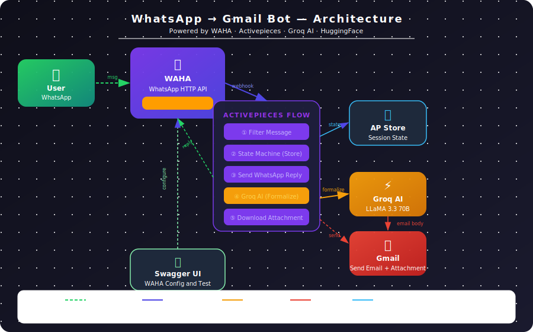

# 📬 Mitram — WhatsApp to Gmail Bot

<div align="center">
<p align="center">
  
</p>

> *"Mitram" — Sanskrit for friend. A bot that acts like a trustworthy friend — listens to you on WhatsApp, understands your informal words, and delivers a polished formal email on your behalf.*


</div>

---

## 🧠 What is Mitram?

**Mitram** is a personal WhatsApp bot that lets you send formal emails just by chatting casually on WhatsApp — in any language, in any informal tone. You type "bhai dhrub ko bol do meeting cancel hai" and Mitram sends a professionally worded email on your behalf.

It runs entirely on [Activepieces](https://activepieces.com), uses [WAHA](https://waha.devlike.pro) (WhatsApp HTTP API) hosted on a **HuggingFace Space** to connect to WhatsApp, and uses **Groq AI (LLaMA 3.3 70B)** to convert your informal message into a polished formal email — complete with attachments.

No paid WhatsApp Business API. No complex setup. Just scan a QR code and you're live.

---

## ✨ Features

- 💬 **WhatsApp-native UX** — entire interaction happens inside WhatsApp, no app to download
- 🌐 **Any language input** — write in Hindi, Hinglish, English — Groq AI understands it all
- ✍️ **Formal email generation** — LLaMA 3.3 70B converts casual messages to professional emails
- 📎 **Attachment support** — send a photo or file on WhatsApp, it gets attached to the email
- 🔄 **Stateful conversation** — remembers who you're sending to, what you wrote, across multiple messages
- 🧠 **Smart filtering** — ignores group chats, status messages, and its own replies (no infinite loops)
- 🆓 **Free to run** — WAHA on HuggingFace free tier + Activepieces free tier + Groq free tier

---

## 🏗️ Architecture

<p align="center">
  
</p>

### How it works — step by step

```
You (WhatsApp)
    │
    │  "hello" / "to: xyz@gmail.com" / sends photo
    ▼
WAHA (HuggingFace Space)
    │  Receives WhatsApp message, fires webhook
    ▼
Activepieces Flow
    ├─ Step 1: Filter — ignore bots, groups, status
    ├─ Step 2: Router — is it a real user message?
    ├─ Step 3: Load state from AP Store (session memory)
    ├─ Step 4: State machine — track conversation stage
    │          (hello → recipient → body → attachment → confirm → send)
    ├─ Step 5: Save updated state back to AP Store
    ├─ Step 6: Send WhatsApp reply (via WAHA API)
    ├─ Step 7: Router — is user ready to send email?
    ├─ Step 8: Groq AI — formalize the message
    ├─ Step 9 (Code): Download attachment from WAHA URL
    ├─ Step 10: Router — has attachment?
    │    ├─ Branch 1: Gmail (with attachment)
    │    └─ Otherwise: Gmail (no attachment)
    └─ Step 11: WhatsApp confirmation message
```

---

## 💬 Conversation Flow

```
You:    hello
Bot:    👋 Hello! I will help you send a formal email.
        Who to send it to?
        📧 Reply: To: email@example.com

You:    to: boss@company.com
Bot:    ✅ Sending to: boss@company.com
        Now type your message (any language, informal is fine!)
        💬 Reply: Body: your message here

You:    body: bhai meeting kal nahi hogi, postpone kar do
Bot:    ✅ Message saved!
        Do you want to attach a file?
        📎 Send file now  ⏭️ Or reply SKIP

You:    [sends a photo]
Bot:    📋 Review:
        📧 To: boss@company.com
        💬 Message: bhai meeting kal nahi hogi...
        📎 Attachment: Yes ✅
        Reply YES to send | Reply NO to start over

You:    yes
Bot:    ⏳ Sending your email now... Please wait!
Bot:    ✅ Email sent successfully!
        📧 To: boss@company.com
        📌 Subject: Request to Postpone Tomorrow's Meeting
```

And the email received:

> **Subject:** Request to Postpone Tomorrow's Meeting
>
> Dear Sir/Madam,
>
> I am writing to inform you that the meeting scheduled for tomorrow has been postponed. Kindly make note of this change and await further communication regarding the rescheduled date.
>
> Yours sincerely,
> Anubhav Kumar Srivastava

---

## 🛠️ Tech Stack

| Layer | Technology | Role |
|-------|------------|------|
| WhatsApp bridge | [WAHA](https://waha.devlike.pro) | Connects to WhatsApp Web, exposes HTTP API |
| Hosting | [HuggingFace Spaces](https://huggingface.co/spaces) | Free Docker hosting for WAHA |
| Automation | [Activepieces](https://activepieces.com) | Flow engine, state storage, routing |
| AI | [Groq](https://groq.com) (LLaMA 3.3 70B) | Converts informal → formal email |
| Email | Gmail (Google OAuth) | Sends the final email with attachment |
| API Docs | [Swagger UI](https://swagger.io) | WAHA's built-in API explorer for config & testing |
| Language | JavaScript | All custom Code steps in Activepieces |

---

## 🤗 WAHA — The Hero of This Project

A huge thanks to **[WAHA (WhatsApp HTTP API)](https://waha.devlike.pro)** — the open-source project that makes this entire bot possible.

WAHA wraps WhatsApp Web into a clean REST API. Instead of dealing with raw WebSocket connections or paying for the official WhatsApp Business API (which requires business verification and costs money), WAHA lets you:

- Connect via QR code scan — just like WhatsApp Web
- Send and receive messages via simple HTTP calls
- Get webhooks fired for every incoming message
- Handle media, attachments, and session management

What makes it even better — WAHA ships as a **Docker container**, which means it can be deployed on **HuggingFace Spaces for free**. This project runs entirely on free tiers.

WAHA also comes with a **built-in Swagger UI** at `/docs` — which was invaluable during development. Instead of guessing what the API expects, the Swagger UI lets you visually configure webhook URLs, test endpoints, check session status, and inspect request/response formats live. That's how this project's webhook was configured and debugged.

> *"Without WAHA, this project would either cost money or be impossible. It's genuinely excellent open-source work."*

---

## 🏅 Badges Earned

<div align="center">
  <table>
    <tr>
      <td align="center">
        <br/>
        <b>🏗️ First Build</b><br/>
        <sub>I published my first flow and automation is officially real.</sub>
      </td>
      <td align="center">
        <br/>
        <b>💻 Coding Chad</b><br/>
        <sub>I used custom code and made my flow do tricks no one else can.</sub>
      </td>
      <td align="center">
        <br/>
        <b>🧙 Webhook Wizard</b><br/>
        <sub>I used webhooks and my triggers are endless now.</sub>
      </td>
    </tr>
  </table>
</div>

---

## 🚀 How I Built This

### The idea

I wanted to send formal emails without opening Gmail, thinking about what to write, or worrying about tone. WhatsApp is always open — so why not use it as the interface?

### The journey

**Step 1 — Finding WAHA**
The first challenge was connecting to WhatsApp programmatically without paying for the Business API. WAHA was the answer — a self-hosted Docker container that runs WhatsApp Web under the hood and exposes a full REST API.

**Step 2 — Hosting on HuggingFace**
WAHA needs to run 24/7. HuggingFace Spaces supports Docker containers and has a free tier — perfect. Deployed WAHA as a Docker Space, scanned the QR code, and the WhatsApp session was live.

**Step 3 — Configuring webhooks with Swagger**
WAHA's built-in Swagger UI (`/docs`) made webhook configuration straightforward. Set the webhook URL to the Activepieces flow endpoint — every incoming WhatsApp message now triggers the automation.

**Step 4 — Building the Activepieces flow**
The flow is a stateful conversation engine. Activepieces Store acts as session memory — it remembers which stage of the conversation each user is in (asking for recipient, asking for message body, asking for attachment, confirming). Each message advances the state machine.

**Step 5 — Adding Groq AI**
The informal message gets sent to Groq's LLaMA 3.3 70B via their free API. A carefully crafted prompt instructs the model to return only a raw JSON object with `subject` and `body` — no markdown, no preamble. The body gets HTML-formatted and sent via Gmail.

**Step 6 — Attachment handling**
This was the trickiest part. WAHA stores received media at a local URL (`localhost:7860/api/files/...`). That URL is unreachable from Activepieces. The fix — replace the localhost hostname with the public HuggingFace Space URL and fetch the file from there using the WAHA API key. The file is then base64-encoded and sent as a Gmail attachment via data URI format.

**Step 7 — Debugging with Swagger**
Every time something broke — wrong webhook, session not connected, media URL format — WAHA's Swagger UI was the debugging tool. `GET /api/sessions/default` showed the session status and active webhooks. `POST /api/sendText` let me test message sending directly without running the whole flow.

### What I learned

- Stateful chatbots need persistent storage — Activepieces Store solved this elegantly
- WAHA's `source: 'api'` and `fromMe: true` flags are essential for preventing the bot from responding to its own messages
- LLM prompts need to be extremely explicit — "return ONLY raw JSON, no backticks, no preamble" matters
- HuggingFace Spaces + Docker is an underrated free hosting combo

---

## 📦 Setup Guide

### Prerequisites

- [Activepieces](https://activepieces.com) account (free tier)
- [HuggingFace](https://huggingface.co) account (free tier)
- [Groq](https://console.groq.com) API key (free tier)
- Gmail account connected via OAuth

### Step 1 — Deploy WAHA on HuggingFace

1. Go to [huggingface.co/spaces](https://huggingface.co/spaces) → Create Space
2. Select **Docker** as SDK
3. In `Dockerfile`, use:
```dockerfile
FROM devlikeapro/waha
ENV WHATSAPP_API_KEY=your_api_key_here
```
4. Commit → Space builds and starts

### Step 2 — Connect WhatsApp

1. Open your Space URL → go to `/docs` (Swagger UI)
2. `POST /api/sessions` → start a session
3. `GET /api/screenshot` → scan the QR code with WhatsApp

### Step 3 — Configure Webhook

In Swagger UI → `PUT /api/sessions/default`:
```json
{
  "config": {
    "webhooks": [{
      "url": "YOUR_ACTIVEPIECES_WEBHOOK_URL",
      "events": ["message.any"]
    }]
  }
}
```

### Step 4 — Import Flow

Import `WhatsappToGmailBot.json` into Activepieces → connect Gmail → add Groq API key to Step 8 inputs.

### Step 5 — Publish

Hit Publish in Activepieces. Send "hello" to your WhatsApp number. 🎉

---

## 👥 Who is this for?

- **Students & professionals** who need to send formal emails but find the language barrier frustrating
- **Non-English speakers** who think in their native language but need English professional emails
- **Anyone** who lives on WhatsApp and hates switching apps to compose emails
- **Developers** looking for a reference on building stateful WhatsApp bots with open-source tools

---

## 🤝 Acknowledgements

**[WAHA](https://waha.devlike.pro)** — For making WhatsApp automation accessible without the Business API.

**[Activepieces](https://activepieces.com)** — For building an open-source automation platform where custom JavaScript is a first-class citizen. The Store, Router, and Code steps made this entire architecture possible.

**[Groq](https://groq.com)** — For blazing-fast LLaMA inference that makes AI feel instant in a chat flow.

**[HuggingFace](https://huggingface.co)** — For free Docker hosting that makes self-hosted tools actually accessible.

---

## 📄 License

MIT — use it, fork it, build on it.

---

*Built with ❤️ by Anubhav Kumar Srivastava*

<p align="center">
  
</p>
